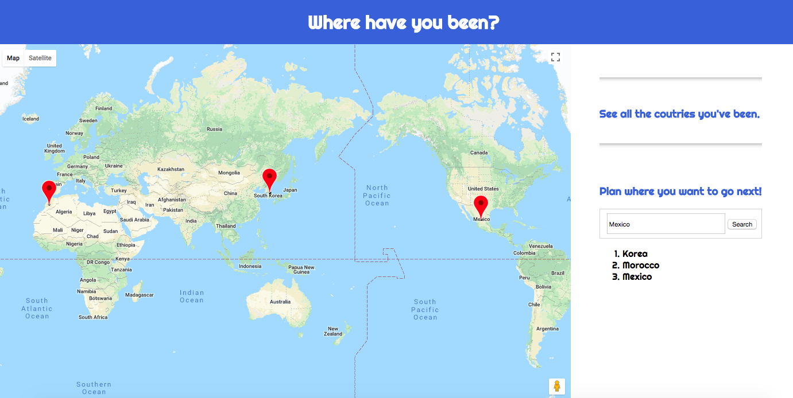

# Where have you been?

### About the project

- This is the second project in the Web Development Immersive Program from GA.
- It is a full-stack application built according to my own idea, design, and front- and back-end skills.
- It has complete CRUD functionality implemented with RESTful routes.
- This application is deployed on Heroku.
  (https://sheltered-scrubland-75667.herokuapp.com/)
- There is a YouTube Video about this application to help you understand better.
  (https://youtu.be/G1B_ytAdEhI)

### How to use this 'Where have you been?' application

- This app can help you arrange your future trips and past trips.
- On the main page it will show the country you want to visit on the map and also make a list.
- On the remaining pages you can create, read, update, and delete the country data you have been.
- Each person can sign up, sign in, and store data for the future use. (Currently working on it)

### How to run

- Clone this repository and open it on local server (http://localhost:3000/)
- Click this link. (https://sheltered-scrubland-75667.herokuapp.com/)

### Used tools in the project

 - Html
 - CSS
 - JavaScript
 - Node.js
 - express
 - Handlebars
 - MongoDB
 - Mongoose
 - NPM
 - Google Maps APIs
 - Materialize CSS

 ### The main page look

 
